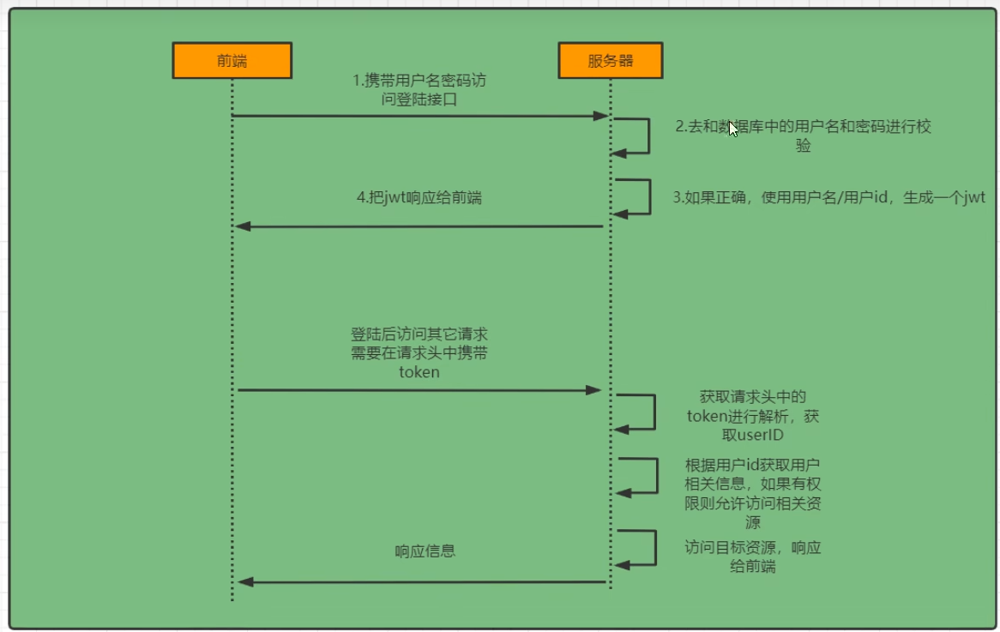
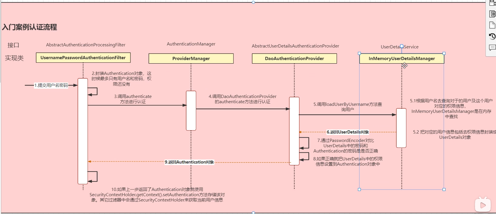
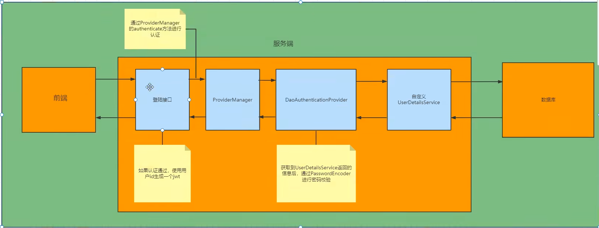
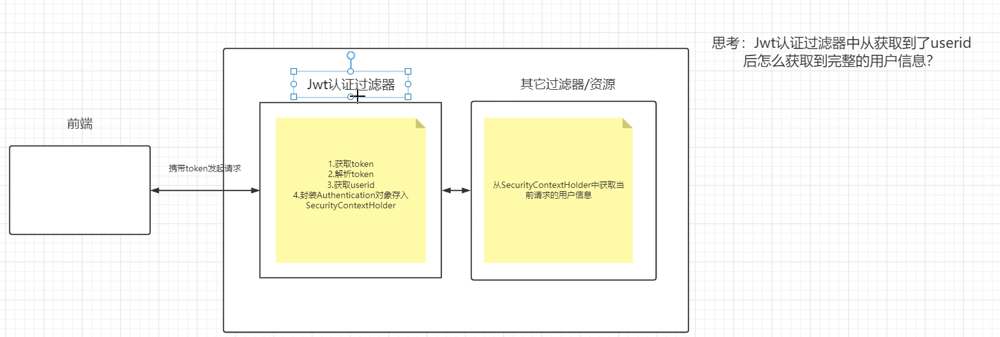
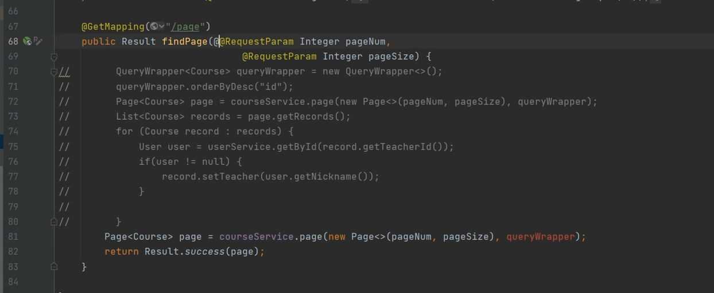
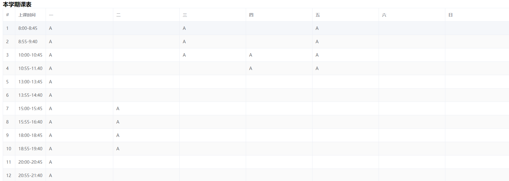
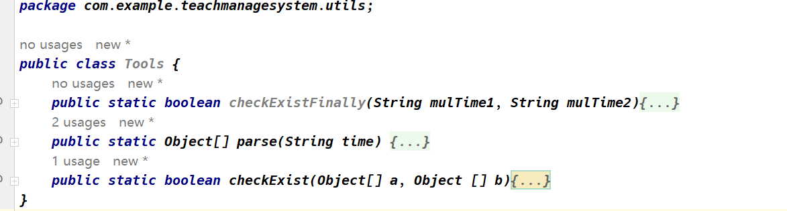

# 教学事务管理系统

> 系统采用B/S架构进行实现：
>
> 系统需要具有不同的角色：***系统管理员***、***教师***、***学生***。
>
> 1. ***系统管理员***：
>
> 学分制教务管理特色的各类功能。
>
> 2. ***学生***：
>
> 学生可以根据每一个学期所开设的课程进行自主选课并有具有查询有关信息的功能。
>
> 3. ***教师：***
>
> 教师根据学生所选择的课程进行成绩登录并且具有日常教学管理的功能。
>
> ***系统需要为不同的角色提供各类统计分析，数据库中至少包含一个触发器和一个存储过程在系统中使用和调用。***

# 1. 功能模块设计

## 1.1 管理员模块

### 1.1.1 人员管理

1. **管理员可以重置学生和教师的密码，但是并不去直接修改为某一确定的密码。**

2. 管理员可以添加学生和教师，并且设置默认的登录密码，然后学生和教师登录之后添加相应的信息，并且可以进行修改。

### 1.1.2 教师授课情况

1. 查看当前教授所教授的所有课程；
2. ***给当前老师分配课程，即从当前同一学院中所开设的课程中挑选一门已经开设的课程；***

### 1.1.3 开放课程管理

该模块即对当前学期的所有的课程进行管理，提供的功能有，查询当前学期所开设的所有的课程，

1. ***查询当前学期中所开设的所有课程；***
2. ***新增开课选项，取消开课选项；***

> ***注意：本项目中开课的流程为，管理员先开放课程，然后再去分配老师！***


## 1.2 学生模块

1. 查询课程信息；

2. 查询考试信息；

3. 学生选课；

- 选课；

- 退课；
- 课表查询；
- 删除课表查询；

## 1.3 教师模块

### 1.3.1 所有课程

***功能设计：***

> - 查看自己本学期所教授的课程；
> - 申请开设本学期没有开设的课程（***实现思路，在选课表中添加记录，状态设置为待审核，***）；

### 1.3.2 针对某一门课程

***功能设计：***

> - 查看选择本门课程的学生所有的信息（提供导出学生名单功能，检索功能，***没有导入功能，没有删除功能和添加功能***）；
> - 登记分数功能，针对每一位学生提供录入成绩的功能，***平时成绩、考试成绩、最终成绩（最终成绩是由平时成绩和考试成绩所决定的，GPA是由最终成绩所决定的）***；
> - 导出学生成绩表；


# 2. 数据库设计

> 注意：几乎所有的表格都设置了一个唯一的字段record_id或者id，该字段的唯一用处就是唯一标识该表格的数据，如果和其他表有外键关联关系，那么就将相应的字段设置为class_record等等。


## 2.1 登录涉及表格

管理员、学生、教师所对应的应该**各有一个密码表以及一个详细信息表**。

***管理员密码表：***

| admin_id | password_hash |
| -------- | ------------- |
| 1        | hashed_pass1  |
| 2        | hashed_pass2  |

***管理员信息表：***

| admin_id | name       | email            |
| -------- | ---------- | ---------------- |
| 1        | John Smith | john@example.com |
| 2        | Jane Doe   | jane@example.com |

```mysql
create table admins(
    admin_id int not null primary key auto_increment,
    admin_name varchar(30) not null ,
    phonenumber varchar(20),
    email varchar(30)
);

create table admin_passwords(
    admin_id int not null primary key,
    password_hash varchar(30) not null
);
```

***教师密码表：***

| teacher_id | password_hash |
| ---------- | ------------- |
| 1          | hashed_pass1  |
| 2          | hashed_pass2  |

***教师信息表：***

| teacher_id | teacher_name | gender | birthday   | position | depart_id |
| ---------- | ------------ | ------ | ---------- | -------- | --------- |
| 1001       | 陈迪茂       | 男     | 1973-03-06 | 副教授   | 1         |
| 1002       | 马小红       | 女     | 1972-12-08 | 讲师     | 1         |

***学生密码表：***

| student_id | password_hash |
| ---------- | ------------- |
| 1101       | hashed_pass1  |
| 1102       | hashed_pass2  |

```mysql
create table teacher_passwords(
    teacher_id int not null primary key ,
    password_hash varchar(30) not null
);

create table student_passwords(
    student_id int not null primary key ,
    password_hash varchar(30) not null
);
```


## 2.2 唯一字段约束

```sql
# 这里意识到一些表的值不能说重复，你可以多个同学的姓名相同，但是那些唯一的id是不能相同的，比如说课程号，这里没有将其设置为主键(为了后面方便修改)
# 这里就需要对课程号添加约束，不能课程号相同,还有就是不能有相同的课程名称

alter table class add constraint unique_class_id unique (class_id);
alter table class add constraint unique_class_name unique (class_name);
# 学院的名字肯定是不能相等的，因为一个学校毕竟只有一个学院
alter table department add constraint unique (depart_name);
insert into department value (6, '计算机学院', '地球', '1234455');
```


## 2.3 开放课程 open_class

> ***注意：***
>
> ***一个课程可以多个老师进行教授，一个老师可以教授多个课程。***
>
> ***上课地点由管理员进行设置，课程容量也是由管理员设置，上课时间由教师自己设置。***

| record_id(开课表的唯一标识) | class_record(课程表的唯一标识) | teacher_id（教师号） | capacity（容量） | enrollment（已选人数） | time（上课时间） | location（上课地点） | term（开设学期） |
| --------------------------- | ------------------------------ | -------------------- | ---------------- | ---------------------- | ---------------- | -------------------- | ---------------- |
|                             |                                |                      |                  |                        |                  |                      |                  |
|                             |                                |                      |                  |                        |                  |                      |                  |

***该表中class_record字段是外键，对应class表的id字段。***


> ***待审核课程表，该表中存储的是教师申请教授的课程，通过设置表属性“status”来判断该表的申请状态。***
>
> *如果是**待审核**就说明该申请管理员没有审核；*
>
> *如果是**未通过**，就说明该申请管理员没有通过该申请，教师申请失败；*
>
> *如果是**已通过**，就说明该申请管理员已经通过该申请，教师申请成功*
>
> `ps`：如果说教师申请开设课程成功的话，管理员就会根据教师申请的信息去填充开放课表，主要去设置**课程的容量大小**以及**上课的地点**，还有就是开设学期。

| class_id(课程号) | teacher_id（教师号） | time（上课时间） | status(审核状态) |
| ---------------- | -------------------- | ---------------- | ---------------- |
|                  |                      |                  |                  |


## 2.4 选课表设计 select_class

> ***选课表，该表中存储的是本学期所有的选课情况，该表还同时记录学生某一门课程的所有的成绩情况。***
>
> 需要注意的是该表存储了所有学期的选课情况。

| record_id(唯一标识)主键 | student_id（学号） | open_record（外键，对应开课表的record_id字段） | usually_score（平时成绩) | test_score（考试成绩） | total_score（最终成绩） |
| ----------------------- | ------------------ | ---------------------------------------------- | ------------------------ | ---------------------- | ----------------------- |
|                         |                    |                                                |                          |                        |                         |
|                         |                    |                                                |                          |                        |                         |
|                         |                    |                                                |                          |                        |                         |

```mysql
create table select_class(
    record_id int not null auto_increment primary key ,
    student_id int not null ,
    open_record int not null ,
    usually_score int ,
    test_score int ,
    total_score int,
    foreign key (open_record) references open_class(record_id)
);
```


## 2.5 触发器设置

触发器设置：

```mysql
# 创建触发器
CREATE TRIGGER update_total_score
BEFORE UPDATE ON select_class
FOR EACH ROW
BEGIN
   IF NEW.usually_score IS NULL OR NEW.test_score IS NULL THEN
       SET NEW.total_score = NULL;
    ELSE
       SET NEW .total_score = NEW.usually_score * 0.3 + NEW.test_score*0.7;
   end if;
END;
```


# FAQ

# 1. 修改主键问题

一般来讲，我们数据库中设计好的主键一般都是不可以进行修改的，但是考虑到如果比如说课程表修改这一类的问题的话，会很麻烦，所以说我这里***额外设置了一个主键该主键除了记录表项记录的唯一性没有别的作用***，这样的话我们就可以随意的修改那些之前被当做主键的值。


# 2. 密码存储问题

## 2.1 密码的安全建议：

- 不要使用明文形式来存储密码，因为这样很容易遭到攻击者的盗取和滥用，建议使用非对称加密算法；
- 建议使用盐值（salt）来加强密码哈希的安全性。盐值是一段随机字符串，可以与密码组合在一起，使得攻击者更难以使用彩虹表（rainbow table）破解密码。
- 不要将密码存储在代码或配置文件中，因为这会使得密码容易被泄露。建议将密码存储在数据库或其他安全存储区域中。
- 建议使用多因素身份验证（MFA）来提高用户账户的安全性。例如，可以使用短信验证码、谷歌验证器等MFA方式。

## 2.2 密码的存储位置问题：

一般是不建议将密码和学生的基本信息存放在一起进行存储，因为密码是敏感信息，我们需要进行特殊保护，而且学生的基本信息可能不需要同样高的保护级别。***同时，如果说我们将密码和其他的信息混合在一起存储的话，会使得密码更加容易被攻击者猜测或者窃取，比如说我们前面获取学生表的信息的时候需要从数据库中取出相关的信息，这个时候就有可能会将我们的密码不小心一起传了出来，所以说，我们不要将密码和用户的信息存放在一起。***

> 通常情况下，密码和学生的基本信息应该存放在不同的数据表中。具体来说，可以建立两个数据表：***一个数据表用于存储学生的基本信息***，***另一个数据表用于存储密码哈希值***。
>
> 在学生信息表中，可以存储学生的姓名、学号、年龄、性别等基本信息，每个学生都有一个唯一的学号作为主键。
>
> 在密码哈希值表中，可以存储学生的学号和对应的密码哈希值。这样可以将密码和其他学生信息分开存储，从而保证密码的安全性。
>
> 在验证学生登录时，可以先根据学号从学生信息表中获取学生的基本信息，然后再根据学号从密码哈希值表中获取对应的密码哈希值，进行密码验证。这样可以方便地查询和管理学生的基本信息，同时也保证了密码的安全性。

# 3. 登录模块设计

***基于Spring Security + JWT实现的认证登录机制以及权限控制。***

> 简单实践，我们只要将其对应的依赖导入我们的*Spring Boot*项目导入之后就可以实现一个简单的认证和授权过程，我们在前端访问数据的时候会被拦截下来要求我们进行一个登录认证的过程：
>
> ```xml
> <!-- https://mvnrepository.com/artifact/org.springframework.boot/spring-boot-starter-security -->
>         <dependency>
>             <groupId>org.springframework.boot</groupId>
>             <artifactId>spring-boot-starter-security</artifactId>
>             <version>3.0.5</version>
>         </dependency>
> ```





我们只需要对`UserDataService`进行一个实现，将其替换为我们符合自己项目结构设计的对应的接口。

首先前端提交相关的用户名和密码到我们的`Controler`类当中，然后我们的`Controler`会去调用后面的`ProviderManage`接口中，然后会调用相应的内容一直到我们自己定义的`UserDataService`当中，查询之后会返回数据到我们自己的`Controler`当中,如果说有相应数据的话，说明校验通过，然后就会生成一个`Token`返回到前端。



我们登陆成功之后需要自定义一个***Jwt认证过滤器***，需要通过前端携带的`Token`来判断当前是否有用户登录，如果有用户登陆之后才可以进行下面的相关操作。

> ***注意，Spring Security的核心逻辑全在这一套过滤器当中，过滤器会调用各种组件完成功能，掌握了这些过滤器和组件你就掌握了Spring Security! 这个框架的使用方式就是对这些过滤器和组件进行扩展。***

# 4. 多表联接查询

> 要想实现多表联接查询的话，最好是去xml文件中定义查询语句，一般是不建议使用***mybatis-plus***提供的功能进行拼接。




# Record

# 2023年4月24日14:39:29

***2023年4月24日14:39:29: 准备记录之后的所有进展！***

# 2023年4月25日00:44:54

***2023年4月25日00:44:54：课程表逻辑初步完成，数据还没有联合起来！！不过代码有点冗余，可以有改进的空间，但是不再进行修改，如果要修改，可以参考下面的想法：***

```js
subArray: [12][{
        orderNumber: null,
        time: null,
        weekArray: {
          monday: null,
          tuesday: null,
          wednesday: null,
          thursday: null,
          friday: null,
          saturday: null,
          sunday: null
        }
      }],
      timeArray: [
          "8:00-8:45","8:55-9:40","10:00-10:45",
          "10:55-11.40","13:00-13:45","13:55-14:40",
          "15:00-15:45","15:55-16:40","18:00-18:45",
          "18:55-19:40","20:00-20:45","20:55-21:40",],
```

**展示如下:**



# 2023年4月26日14:08:26

昨天晚上写了一个处理两个时间段是否出现时间冲突的函数，就是为了学生选课的时候是否出现时间冲突，没有时间冲突随便选择。



新增了一个tools类，将所有额外的算法处理算法放在这里！

# 2023年4月26日21:53:53

```java
@GetMapping("/student/select")
    public APIResponse<?> selectClass(@RequestParam String encodeStudent,
                                   @RequestParam String encodeData) throws UnsupportedEncodingException, JsonProcessingException {
        // 先进行相关的设置
        ObjectMapper objectMapper = new ObjectMapper();
        objectMapper.registerModule(new JavaTimeModule());

        // 解码
        String decodedStudent = URLDecoder.decode(encodeStudent, "UTF-8");
        String decodedData = URLDecoder.decode(encodeData, "UTF-8");

        // 转换
        Student student = objectMapper.readValue(decodedStudent, Student.class);
        System.out.println(student);
	      List<OpenClass> openClasses = objectMapper.readValue(decodedData, new ArrayList<OpenClass>().getClass());
        // 我们获取json数据之后并且将其转换为list类型以后,我们是不能直接去使用list数据的,因为此时的list的类型是LinkedHashMap
        // 我们仍然需要进行一次转换,转换的过程中再将其转换为我们真正想要的数据类型
        List<OpenClass> openClasses1 = objectMapper.convertValue(openClasses,new TypeReference<List<OpenClass>>() {});

        /**
         * 将处理好的学生信息以及对应学生的选课信息传入
         * 处理后的结果可能有以下几种：
         * 1. 选课失败！原因：选课时间冲突
         * 2. 选课成功！
         */

        return iSelectClassService.studentSelect(student, openClasses1);
    }
```

***bug修复，这里之前传参数的时候一直传的是`LinkedHashMap`类型的数据，这个类型不可以直接使用，需要额外的进行另外的转换:***

```java
List<OpenClass> openClasses1 = objectMapper.convertValue(openClasses,new TypeReference<List<OpenClass>>() {});
```

这里转换之后才是我们最终想要的数据类型。

# 2023年4月27日18:18:10

下午的时候发现了一个特别严重的bug，和JavaScript有关的bug, 简而言之就是和同步和异步有关的，因为JS要来做渲染页面的事情，要考虑很多东西，所以说一切都按序就班这样是不可能的，就会给使用者带来极其不好的游戏体验，所以说有的地方JS不是按照顺序执行的，本次bug就是和这里有关，有的时候我们从后端请求数据，然后将数据渲染到指定的页面：

```javascript
 async created() {
    // 获取用户信息
    await this.getUser();
    await this.load();
    // 同步
    await this.getAllClassTime();

    this.handleData();
  },


····

// 同步
    async getAllClassTime(){
      await this.request.get("/select-class/student/allTime",{
        params: {
          studentId: this.user.studentId
        }
      }).then(reponse => {
        this.allTime = reponse.data;
      })
    },
```

# 2023年4月27日23:28:37

学生部分选课和退课模块设计完成，数据库新增了大量的数据，开课信息打算写完接口再去生成数据。

# 2023年4月28日20:38:31

SQL语句错误：

```mysql
select distinct t.*
from teacher t
join department d on t.depart_id = d.depart_id
where d.depart_name = '机电工程与自动化学院'
    and t.teacher_id not exists (
    select distinct o.teacher_id
    from open_class o
    join class c on o.class_record = c.id
    where c.class_id = '0000008');
```

这里如果说子查询结果为空的话，那么整个语句的返回结果也是为空，这里需要借助于***NOT EXISTS***来解决这个问题：

```mysql
SELECT DISTINCT t.*, depart_name
FROM teacher t
JOIN department d ON t.depart_id = d.depart_id
WHERE d.depart_name = '生命科学学院'
AND NOT EXISTS (
    SELECT 1
    FROM open_class o
    JOIN class c ON o.class_record = c.id
    WHERE c.class_id = '12345678'
    AND o.teacher_id = t.teacher_id
);
```

